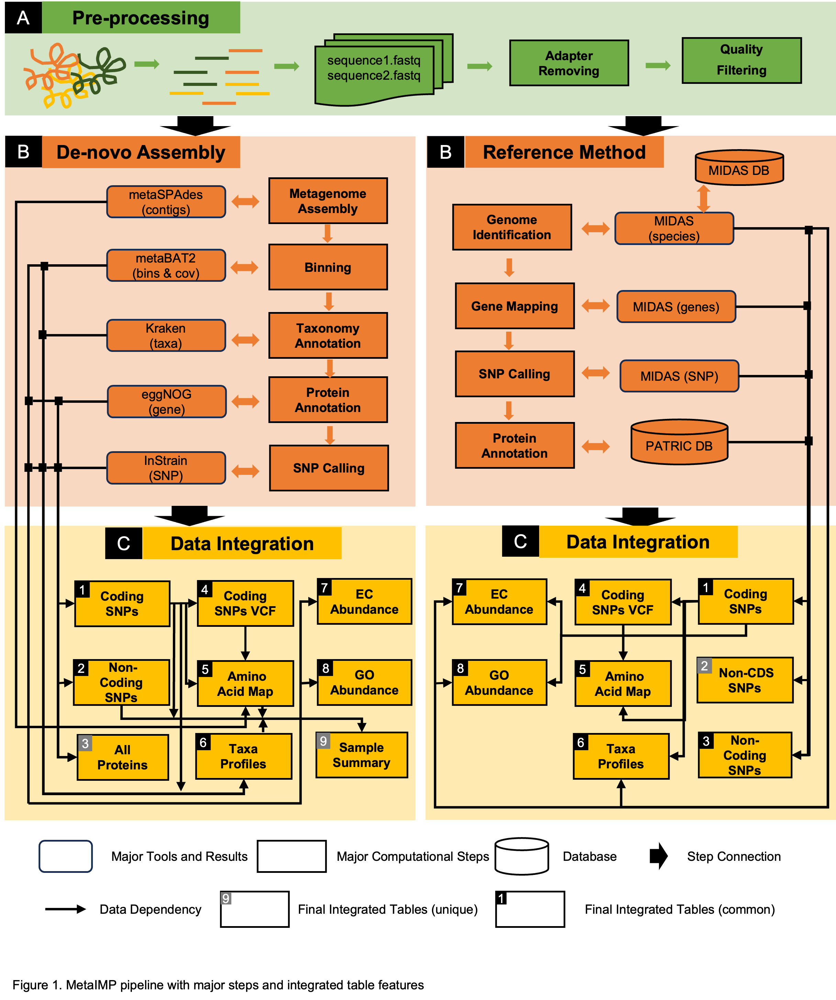

MetaIMP
-------------
1. INTRODUCTION
-------------
metaIMP is an integrated metagenomic pipeline which allows users to identify mutations and their respective protein annotations using a pipeline model. In this document, we list out the steps to be followed by a user to successfully complete assembly and reference based methods of metagenomic analysis. Users can choose either the assembly or reference method to begin processing of two paired-end files provided as input in FASTA format.




-------------
2. INSTALLATION
-------------
metaIMP requires a cocktail of Java, Python and Linux scripts in order to provide the most accurate analysis of user's metagenome data. Backend is based on Linux, which can be accessedusing any unix terminal.

To download metaIMP from Github, use : git clone https://github.com/yao-laboratory/metaIMP

After the repo is cloned, user can run the following shell script to install their custom python environment.
Note: Users must have 'conda' and 'mamba' installed in their systems before proceeding with installation. This is a prerequisite.
```
export $USER_ENVIRONMENT

1) ./install.sh
2) ./install_test.sh
```
User can either run install.sh or refer to example_hcc_install.sh for creating a job.


Required constants:

2. 1 ASSEMBLY BASED ANALYSIS:
```
1. KRAKEN_DATABASE: kraken/2.0
2. PHYLOPHLAN_DATABASE: SGB.Jan19 
3. EGGNOG_DIAMOND_DATABASE: eggnog-mapper/2.1.3
```

2. 2 REFERENCE BASED ANALYSIS:
```
1. database_folder: midas_db_v1.2
```

-------------
3. TUTORIAL
-------------

metaIMP is an integrated metagenomic pipeline which allows users to identify mutations and their respective protein annotations using a pipeline model. In this document, we list out the steps to be followed by a user to successfully complete assembly and reference based methods of metagenomic analysis. Users can choose either the assembly or reference method to begin processing of two paired-end files provided as input in FASTA format.
The users must download the metaIMP repository and use the local folder path of the repo as input to all the sh scripts.


3. 1 ASSEMBLY BASED ANALYSIS:

STEP 0: Download fastq files from NCBI (http://ncbi.nlm.nih.gov)

```
fastq-dump --split-files SRR9205532 

```

STEP 1: Update the stand alone job script with input parameters available in the example folder.

```
cd /metaIMP/example/
metaIMP_path=/home/metaIMP
export USER_ENV_NAME=metaIMP_env
fastq1=SRR9205532_1.fastq
fastq2=SRR9205532_2.fastq
sample_ID=SRR9205532 
threads=8 
con_len=1000
assembly_mode=1  
output_folder_assembly=/home/metaIMP_output/assembly_output/
```


STEP 2: Submit job

* Submit stand alone job for assembly pipeline using the stand alone example jobs in the Example folder.

```
cd metaIMP/example/
sbatch example_stand_alone_job_assembly.sh
(or)
bash ./example_stand_alone_job_assembly.sh
```


STEP 3: Verify results 
* Users can verify the results in the output folder generated by metaIMP.

```
cd metaIMP/ASSEMBLY_SNP_ANNOTATION
```


3. 2 REFERENCE BASED ANALYSIS:


STEP 0: Download fastq files from NCBI (http://ncbi.nlm.nih.gov)
	
```
fastq-dump --split-files SRR9205532

```

STEP 1: Update the stand alone job script with input parameters available in the Example folder.

```
cd /metaIMP/example/
metaIMP_path=/home/metaIMP
export USER_ENV_NAME=metaIMP_env
fastq1=SRR9205532_1.fastq
fastq2=SRR9205532_2.fastq
sample_ID=SRR9205532
threads=8
con_len=1000
output_folder_reference=/home/metaIMP_output/reference_output/
```

STEP 2: Submit job

* Submit stand alone job for assembly pipeline using the stand alone example jobs in the Example folder.

```
cd metaIMP/example/

sbatch example_stand_alone_job_reference.sh
(or)
bash ./example_stand_alone_job_reference.sh
```


STEP 3: Verify results
* Users can verify the results in the output folder generated by metaIMP.

```
cd metaIMP/REFERENCE_SNP_ANNOTATION
```


----------------------
4. COMMAND LINE AND INPUT
----------------------
In this pipeline, the user will need to provide the following information:

1) Input paired-end file path
2) Output folder path
3) Number of threads
4) Minimum contig length ( OPTIONAL) (ASSEMBLY ONLY) - if the user wants to filter contigs after assembly process, this option should be used.
5) Path to metaIMP directoryEnvironment variable calling

Users must run install.sh to create an environment for metaIMP. Next, users can either use the stand-alone version or the OSG version
from the examples folder to complete their analysis. 'Example' folder has sample jobs for user reference.

```
1) read1 = Forward paired-end file (FASTQ)
2) read2 = Reverse paired-end file (FASTQ)
3) sampleID = sample name used in renaming the fastq reads and later processing
4) output_folder= Output folder path
5) min_thread= Total number of threads
6) min_contig_length (OPTIONAL) = filter contigs based on minimum length (ex: 1000)


4.1 ASSEMBLY COMMAND LINE:

$metaIMP_path/main_assembly_processing.sh $fastq1 $fastq2 $sampleID $output_folder_assembly $threads $con_len

4.2 REFERENCE COMMAND LINE:

$metaIMP_path/main_reference_processing.sh $fastq1 $fastq2 $sampleID $database_folder $output_folder_reference $threads
```
------
5. OUTPUT
------
If mutations are not detected, then user can expect Tables 1, 2, 4, 5, and 6 to be empty.


---------------------------------------------------------------------------------
---------------------------------------------------------------------------------
<pre>
   ASSEMBLY OUTPUT FOLDER
   |--ASSEMBLY SNP ANNOTATION 
   |-- METASPADES 
   |   |-- CONTIGS.FASTA 
   |   |-- COVERAGE.TXT
   |   |-- ALN.SAM.GZ 
   |   |-- DEPTH.TXT
   |-- BINS 
   |   |-- CHECKM 
   |-- EGGNOG 
   |-- INSTRAIN
   |-- DAS_TOOL 
   |-- PHYLOPHLAN
   |-- KRAKEN
   |-- FASTQC 
   |-- QUAST 
   |-- LOG FOLDER 
   |-- TEMP FOLDER


   REFERENCE OUTPUT FOLDER
   |--REFERENCE SNP ANNOTATION
   |-- MIDAS
   |   |-- SPECIES
   |   |-- GENES
   |   |-- SNPS
   |-- FASTQC
   |-- LOG FOLDER
   |-- TEMP FOLDER

</pre>

Output Dataframes:


| Dataframe	| Assembly      | Reference    | Description (A: Assembly, R: Reference|
| ------------- | ------------- | ------------ | ----------- |
| Table 1       | Assembly_mapping_result_coding.csv  | Reference_mapping_result_coding.csv | Coding region mutation information |
| Table 2       | Assembly_mapping_result_non_coding.csv  | Reference_mapping_result_non_cds_gene.csv | A: Non-coding level information R: Non-CDS gene information |
| Table 3	| Assembly_complete_protein.csv	| Reference_mapping_result_non_coding.csv | A: Protein details with scaffold informtation R: Non-coding mutation information |
| Table 4	| Assembly_mapping_result_coding.vcf|Reference_mapping_result_coding.vcf| VCF files |	
| Table 5	| Assembly_AA_mapping_result.csv| Reference_AA_mapping_result.csv| Amino acid details with scaffold information |	
| Table 6	| Assembly_bin_species.csv| Reference_mapping_result_total_mutation.csv| A: Bin information mapped with species R: Total mutation count/species |	
| Table 7	| Assembly_EC_table.csv	| EC_gene.csv, EC_ref.csv | A: EC information R: EC information for gene id and ref id |
| Table 8	| Assebmly_GO_table.csv	| GO_gene.csv, GO_ref.csv | A: GO information R: GO information with gene id and ref id |


----
6. Table Dependency
----

6. 1 ASSEMBLY BASED ANALYSIS:

Table 1: This table consists of mutation level information in the coding region. Coding region mutations detected by Instrain are mapped with annotations collected from Eggnog. 

Dependencies: Instrain, Eggnog


Table 2: This table consists of mutation level information in the non-coding region. Non-coding region mutations detected by Instrain are mapped with annotations collected from Eggnog.

Dependencies: Instrain, Eggnog

Table 3: This table consists of the the protein information. Annotations from Eggnog are mapped with protein level information extracted from CheckM.
Dependencies: Eggnog, CheckM

Table 4: This is a VCF file summarazing Table 1 results. 

Dependencies: Table 1

Table 5:This table maps the amino acid sequences with their respective mutations in the coding region.

Dependencies: Table 1, Table 4, Contigs generated during assembly

Table 6:This table maps the binning information collected with the species level annotations. 

Dependencies:Table 1, Kraken directory, Scaffold file, Instrain SNPs, Coverage file, Checkm Stats file

Table 7:This table consists of the mutations mapped with their EC numbers.

Dependencies:Eggnog,Instrain,Table 1, Scaffold file, Kraken directory

Table 8: This table consists of the mutations mapped with their GO numbers.

Dependencies:Eggnog,Instrain,Table 1, Scaffold file, Kraken directory


6. 2 REFERENCE BASED ANALYSIS:

Table 1: This table consists of mutation level information in the coding region.         

Dependencies: MIDAS, Patric Db

Table 2: This table consists of mutation level information in the non-coding region. 

Dependencies: MIDAS, Patric Db

Table 3: This table consists of protein level information.

Dependencies: MIDAS,Patric db

Table 4: This is a VCF file summarazing Table 1 results.

Dependencies: Table 1

Table 5: This table maps the amino acid sequences with their respective mutations in the coding region.

Dependencies: Table 1, Table 4

Table 6: This table displays total mutation count for each species.

Dependencies: Table 1

Table 7:This table consists of the mutations mapped with their EC numbers.

Dependencies: Table 1,2,3,

Table 8: This table consists of the mutations mapped with their GO numbers.

Dependencies: Table 1,2,3


----
7. TIPS
----
In order to install dependencies independently for this pipeline using conda/mamba, use the following commands:


1) How to use log file

Users can resume at any step by erasing the log file of a particular process and then restarting the pipeline.

```
cd ./log_folder

rm preprocessing.log

sbatch example_stand_along_job.sh

```
Log file list:

Preprocessing.log: Tracks preprocessing.sh

ASSEMBLY BASED METHOD:

*Assembly_binning.log: Tracks assembly_binning.sh including index file creation, SAM + BAM file process and sorting, Bowtie binning method, coverage file creation.

*Assembly_methods.log: Tracks assembly modes: Modes 1,2 is for MetaSpades. Modes 3,4 is for Megahit.

*Binning__taxonomy.log: Tracks taxonomy related tools: DAS_Tool, Kraken, Phylophlan.

*Assembly_contig_annotation.log: Tracks Eggnog.

*Snp_calling.log: Tracks Instrain.

*Snp_annotation.log: Tracks Tables 1-3 in ASSEMBLY_SNP_ANNOTATION folder.

*Protein_annotation.log: Tracks Tables 4-8 in ASSEMBLY_SNP_ANNOTATION folder.  

REFERENCE BASED METHOD:

*ref_species_genes_snps.log: Tracks MIDAS.

*Snp_annotation.log: Tracks Tables 1-3 in ASSEMBLY_SNP_ANNOTATION folder.

*Protein_annotation.log: Tracks Tables 4-8 in ASSEMBLY_SNP_ANNOTATION folder.

2) Use your own contig file

Users can replace the contig.fasta file created by metaIMP post-assembly and resume metaIMP pipeline. This would allow users to use a pre-existing contig file.

3) Submit job from Open-Science Grid (OSG) using example OSG jobs in the Example folder.

Users can also submit jobs by requesting time on the OSG servers. This method may be time consuming as resources are limited on OSG.

4) For users from University of Nebrasaka, Lincoln

UNL users can submit a job for metaIMP using the Holland Computing Center's resources. We have provided examples for these jobs in the 'EXAMPLE' folder (example_hcc_install.sh)

---------------------------------------------------------------------------------------

